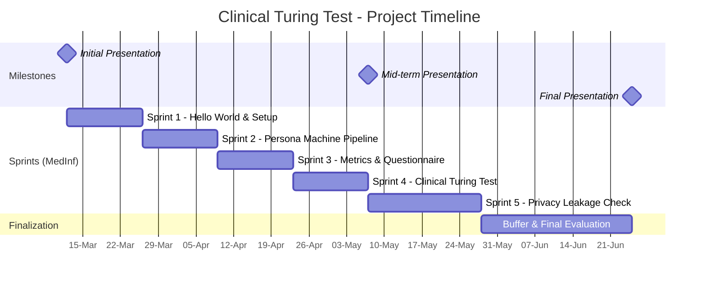

# Clinical Turing Test: Synthetic Clinical Text Generation

Welcome to the **Clinical Turing Test** project! This repository contains the resources, instructions, and timeline for your Medical Informatics elective project. To review the kick-off presentation click [here](https://phiwi.github.io/clinical-turing-test/).

## 🎯 Project Overview

The goal of this project is to generate **realistic, privacy-safe discharge summaries** that maintain clinical logic and utility. By creating high-quality synthetic data, we aim to unlock NLP research that is currently blocked by data privacy constraints.

**Key Objectives:**

- **Generate**: Produce coherent discharge summaries using local LLMs (Llama 3, Mistral) via Ollama.
- **Validate**: Ensure clinical consistency (diagnoses, meds, follow-up) and safety (no PHI leakage).
- **Evaluate**: Conduct a "Clinical Turing Test" where medical experts review mixed real/synthetic notes in a blind setup.

## 🚀 Getting Started

### 1. Access & Environment

Before we begin, ensure you have access to the compute resources.

1. **Start Here (CRITICAL)**: Follow [instructions/start_here.md](instructions/start_here.md) for the full student pipeline.
2. **Get Cluster Access**: Follow [instructions/wireguard.md](instructions/wireguard.md) to contact our admin Harald Wilhelmi and set up your VPN credentials.
3. **LLM Setup**: Read [instructions/ollama.md](instructions/ollama.md) to run Ollama + Python on Slurm.
4. **Development Environment**: Use [instructions/jupyterhub.md](instructions/jupyterhub.md) for notebook workflows and kernels.

### Student Onboarding Path (Use In This Order)

If you are new to clusters, follow this exact route:

1. [instructions/start_here.md](instructions/start_here.md)
2. [instructions/wireguard.md](instructions/wireguard.md)
3. [instructions/cluster.md](instructions/cluster.md)
4. [instructions/venv.md](instructions/venv.md)
5. [instructions/slurm.md](instructions/slurm.md)
6. [instructions/ollama.md](instructions/ollama.md)
7. [instructions/ollama_playground.md](instructions/ollama_playground.md) (for debugging)
8. [instructions/jupyterhub.md](instructions/jupyterhub.md) (optional notebooks)

### 2. Immediate Tasks

- **Familiarize**: Check our [Recommended Reading](#-resources) to grasp the core concepts of Prompting and the Turing Test methodology.
- **Set Up**: Verify your cluster access and try reaching the Ollama endpoint.
- **Plan**: Review the Gantt chart below to understand the project timeline.

---

## 🏃 Sprint 1: The "Hello World" of Clinical Prompting (Weeks 1-2)

Before we build complex automated pipelines, we need to understand how the model "thinks" and where it fails. Your goal for the first two weeks is a simple, hands-on prototype.

- **Goal**: Write a simple Python script (using the `requests` library, `openai` python client, or `LangChain`) to interact with our local Ollama server.
- **Task**: Prompt a local model (e.g., Llama-3-8B) to write a short discharge summary for a fictional 75-year-old patient with heart failure.
  - Try one **"Zero-Shot"** prompt (just asking it to write).
  - Try one **"Few-Shot"** prompt (providing a template or a fake example in the prompt).
- **Deliverable**: A short Python script and 5 generated `.txt` files containing the artificial summaries.
- **Key Insight**: You will quickly notice formatting issues, overly dramatic language, or clinical hallucinations. Finding these errors is the first step—solving them will be our main task for the semester!

---

## ⚙️ Sprint 2: The "Persona Machine" Pipeline (Weeks 3-4)

Manually typing prompts won't scale. To generate a diverse and useful dataset, we must decouple the *clinical content* (the facts) from the *linguistic style* (the hospital jargon). We achieve this through a 3-step automated generation pipeline driven by structured clinical profiles.

To build this pipeline efficiently, we divide the work into three interconnected modules (roles):

1. **The Profiler (Information Extraction):** Extracts structured "Clinical Personas" (Age, Diagnoses, Medications) from our real, de-identified *CARDIO:DE* corpus into a clean JSON format.
2. **The Ghostwriter (Generation):** Designs the "Cross-Pollination" prompt. Takes the JSON persona (content) and injects it into a prompt alongside a random *CARDIO:DE* letter (style template) to force the LLM to generate a novel, synthetic discharge summary.
3. **The Critic (Validation):** Implements an automated cycle-consistency check. Extracts the facts from the *newly generated* synthetic letter and compares them against the original input JSON to detect hallucinations or missing information.

- **Goal**: Build an automated, verifiable generation pipeline.
- **Deliverable**: A robust Python pipeline (connecting the three modules) and 20 highly structured, reproducible, and automatically validated synthetic discharge summaries.
- **Key Insight**: The quality of synthetic data heavily depends on the variance of the input and the strictness of the prompt. Systematic input generation (The Profiler) combined with automated quality control (The Critic) prevents the LLM (The Ghostwriter) from collapsing into a "default" patient persona or hallucinating facts.

---

### 🛠️ Sprint 2 Toolbox: Libraries & Frameworks

To build robust LLM pipelines (especially for structured JSON extraction), you should move beyond raw API calls. We highly recommend using a modern LLM orchestration framework. Choose *one* of the following that best fits your workflow:

**Native Integration (The Basics):**
- [Using Ollama with Python: A Simple Guide](https://medium.com/@jonigl/using-ollama-with-python-a-simple-guide-0752369e1e55) - Good for understanding the raw mechanics.

**Modern Frameworks (Choose one):**

- [BoundaryML / BAML](https://docs.boundaryml.com/ref/llm-client-providers/openai-generic) - *Highly recommended!* Excellent for strict, type-safe JSON extraction (Crucial for "The Profiler" and "The Critic").
- [Google Genkit](https://genkit.dev/docs/js/integrations/ollama/) - The newest, highly powerful orchestration framework from Google (Note: Primarily JS/TS, but Python SDK is evolving).
- [LangChain](https://docs.langchain.com/oss/python/integrations/providers/ollama) - The classic, widely-used industry standard.

For convenience, we've also added ready-to-run example scripts so you can quickly start an Ollama server and send test queries without copy-pasting from multiple guides: [examples/slurm_ollama_server_playground.sh](examples/slurm_ollama_server_playground.sh) and [examples/ollama_query.py](examples/ollama_query.py). These scripts mirror the patterns in the Ollama guide and are provided to help students get started faster and reduce copy/paste errors.

☕ **For your coffee break:**
- *Why is synthetic data currently so important?* Read this excellent, brief introduction on [Finephrase by HuggingFace](https://huggingface.co/spaces/HuggingFaceFW/finephrase#introduction).

---

## 📊 Sprint 3: Metrics & Questionnaire Design (Weeks 5-6)

Before we test the data on real doctors, we need a scientific framework to measure success. "Looks good to me" is not a scientific metric!

- **Goal**: Design the evaluation framework for the Clinical Turing Test.
- **Task**: Base your metrics on the provided literature (Peng et al.). Create a questionnaire assessing fluency, formatting, and medical consistency (e.g., do the prescribed medications actually match the generated diagnoses?). Set up a survey tool (e.g., Google Forms or SoSci Survey). *Note: Collaborate with Emre to ensure the questions make sense to clinicians.*
- **Deliverable**: A finalized questionnaire ready to be distributed to our medical experts.
- **Key Insight**: A Turing Test is only as good as the questions asked. Vague questions yield useless data, while targeted clinical questions reveal the true limitations of the LLM.

---

## 🧑‍⚕️ Sprint 4: The Clinical Turing Test (Weeks 7-8)

The core experiment! It is time to see if your synthetic data can fool medical experts.

- **Goal**: Execute the blind review study.
- **Task**: Mix 10 real (strictly anonymized) discharge summaries with 10 of your best synthetic summaries. Distribute the blind survey to our clinical experts (Emre and colleagues) for evaluation. Analyze the results.
- **Deliverable**: Collected survey data and a statistical summary (e.g., "Physicians identified fake letters in X% of cases"). *Note: This aligns perfectly with your Mid-term Presentation!*
- **Key Insight**: Even if the AI fails the test, understanding *why* it failed (e.g., grammar was "too perfect", subtle medical contradictions, weird document structure) is a fantastic scientific result!

---

## 🔒 Sprint 5: Privacy Leakage Check (Weeks 9-11)

Now that we have realistic data, we must ensure it is safe. Did the model accidentally memorize and leak real patient data from the few-shot examples?

- **Goal**: Evaluate the privacy guarantees of your generation pipeline.
- **Task**: Write a script/method to check if any specific information from your real few-shot examples (even if anonymized, check for specific unique combinations of symptoms/names) "leaked" into the synthetic outputs.
- **Deliverable**: A short privacy audit report demonstrating that the synthetic data is fully decoupled from the input examples and safe for sharing.
- **Key Insight**: Realistic data is useless if it violates GDPR/HIPAA. True synthetic data must be completely disconnected from real individuals.

---

## 🏁 Finalization: Buffer & Final Evaluation (Weeks 12-15)

Research always takes longer than expected. We use the last weeks of the semester to polish our work, document the code, and prepare for the final presentation.

- **Goal**: Clean up code, finalize data analysis, and prepare the Final Presentation.
- **Task**: Refactor your Python code into a clean, well-documented repository. Create visualizations (e.g., confusion matrices, score distributions) for your Turing Test results. Prepare your final slides.
- **Deliverable**: A clean GitHub repository (so the next group of students can use your pipeline!) and the Final Presentation.
- **Key Insight**: Good research is reproducible research. If your pipeline is easy to use, it will actively help our lab generate data for future NLP projects!

---

## 📅 Project Timeline

We have a structured roadmap for the semester. Please refer to this Gantt chart for key milestones and deadlines.

## 📚 Resources

### Recommended Reading & Core Papers

To successfully execute this project, we will focus entirely on **Advanced Prompt Engineering** (In-Context Learning). We do not need complex Fine-Tuning (like LoRA or RLHF) for now. Please focus on the following core resources:

#### 1. The "Must-Read" Scientific Papers (Project Core)

- **The Methodology (The Turing Test)**:[A study of generative large language models for medical research and healthcare (Peng et al., 2023, npj Digital Medicine)](https://www.nature.com/articles/s41746-023-00958-w)
  - *Why it's important*: This paper is the exact blueprint for our evaluation. The authors generated synthetic clinical notes using a medical LLM and had physicians blindly evaluate them to see if they could spot the "fake" [1, 2]. Pay close attention to *how* they set up the questionnaire (using a 1-9 scale for readability and clinical relevance) and the statistical results they achieved [3].
- **The Privacy Aspect**:[Controllable Synthetic Clinical Note Generation with Privacy Guarantees (Baumel et al., 2024, arXiv)](https://arxiv.org/abs/2409.07809)
  - *Why it's important*: This addresses the "Why are we doing this?" of our project. It explains the risk of Personal Health Information (PHI) limiting medical datasets and how synthetic generation acts as a privacy shield. It gives you a great overview of how synthetic data can retain the statistical utility of real data without compromising patient privacy [4, 5, 6]

#### 2. Prompt Engineering (Practical Skills)

*The art of guiding the LLM to generate exactly what we want, in the format we need.*

- **Guide**:[OpenAI Prompt Engineering Guide](https://platform.openai.com/docs/guides/prompt-engineering) - Excellent starting point for strategies like Few-Shot prompting.
- **Techniques**: [PromptingGuide.ai](https://www.promptingguide.ai/) - A comprehensive resource. Look specifically at "Techniques" > "Few-Shot Prompting" and "Chain-of-Thought".

### Tools & Infrastructure

- **Ollama**:[Official Documentation](https://ollama.com/)
- **Slurm**: [Dieterichlab Cluster Guide](instructions/cluster.md)
- **Local Guides**: [Student Start Guide](instructions/start_here.md), [Slurm Basics](instructions/slurm.md), [Ollama Playground (debugging)](instructions/ollama_playground.md)

---

## 📞 Contact & Next Meeting

**Next Meeting**: *[Date/Time TBD - Check Email/Calendar]*

**Contact:**

- Philipp Wiesenbach
- Emre Calik
- Dieterichlab, Computational Cardiology
