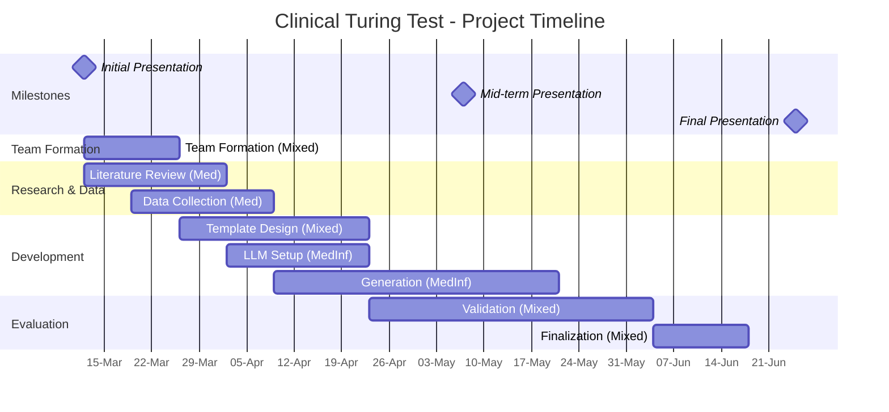

# WFT-2026-Clinical-Turing-Test: Synthetic Clinical Text Generation

Welcome to the **Clinical Turing Test** project! This repository contains the resources, instructions, and timeline for your Medical Informatics elective project.

## 🎯 Project Overview

The goal of this project is to generate **realistic, privacy-safe discharge summaries** that maintain clinical logic and utility. By creating high-quality synthetic data, we aim to unlock NLP research that is currently blocked by data privacy constraints.

**Key Objectives:**

- **Generate**: Produce coherent discharge summaries using local LLMs (Llama 3, Mistral).
- **Validate**: Ensure clinical consistency (diagnoses, meds, follow-up) and safety.
- **Evaluate**: Conduct a "Clinical Turing Test" where medical experts review mixed real/synthetic notes.

## 🚀 Getting Started

### 1. Access & Environment

Before we begin, ensure you have access to the compute resources.

1. **Get Cluster Access (CRITICAL)**: Follow the guide in [instructions/lab.guides.wireguard.md](instructions/lab.guides.wireguard.md) to contact our admin Harald Wilhelmi and set up your VPN credentials. **This is the first step.**
2. **LLM Setup**: Read [instructions/lab.guides.ollama.md](instructions/lab.guides.ollama.md) to learn how to run local LLMs (Ollama) on our GPUs.
3. **Development Environment**: Set up your workspace using [instructions/jupyterlab.md](instructions/jupyterlab.md).

### 2. Immediate Tasks

- **Familiarize**: Start getting comfortable with **Prompt Engineering** (Priority 1) and **Synthetic Data Generation** (Priority 2) by checking our [Recommended Reading](#-resources). No deep dive needed yet, just get the concepts.
- **Set Up**: Verify your cluster access and try running a "Hello World" with Ollama.
- **Plan**: Review the Gantt chart below to understand the project timeline.

---

## 📅 Project Timeline

We have a structured roadmap for the semester. Please refer to this Gantt chart for key milestones and deadlines.

## 📚 Resources

### Recommended Reading & Tutorials

To prepare for the "Clinical Turing Test", please familiarize yourself with the following topics. We will start with **Prompt Engineering** and move to more advanced techniques like **Fine-tuning** if needed.

#### 1. Prompt Engineering (Priority)

*The art of guiding the LLM to generate exactly what we want.*

- **Guide**: [OpenAI Prompt Engineering Guide](https://platform.openai.com/docs/guides/prompt-engineering) - Excellent starting point for strategies like Few-Shot and Chain-of-Thought.
- **Techniques**: [PromptingGuide.ai](https://www.promptingguide.ai/) - A comprehensive resource. Look specifically at "Techniques" > "Few-Shot Prompting" and "Chain-of-Thought".

#### 2. Synthetic Data Generation

*Methodologies for creating artificial but realistic data.*

- **Concept**: [Synthetic Data with LLMs (HuggingFace)](https://huggingface.co/blog/synthetic-data-save-costs) - A practical guide on using LLMs to create data.
- **Clinical Context**: *Paper to search*: "ClimatText: Evaluating and Improving Faithfulness in Clinical Note Generation" (Arxiv/ACL).
- **Privacy**: *Search term*: "Synthetic Clinical Data Generation with Differential Privacy".

#### 3. Fine-tuning & LoRA (Advanced)

*Adapting the model to our specific style using Low-Rank Adaptation.*

- **Concept**: [LoRA Conceptual Guide](https://huggingface.co/docs/peft/conceptual_guides/lora) - Understand the intuition behind parameter-efficient fine-tuning.
- **Practical Guide**: [HuggingFace PEFT Library](https://huggingface.co/docs/peft/) - We might use this library if we fine-tune Llama 3 on our cluster.

#### 4. Reinforcement Learning (RLHF)

*Optimizing for specific metrics (like clinical consistency) rather than just next-token prediction.*

- **Overview**: [Illustrating RLHF (HuggingFace Blog)](https://huggingface.co/blog/rlhf) - A visual guide to Reinforcement Learning from Human Feedback.
- **Relevance**: We can use RL to optimize our models to maximize a "Clinical Consistency Score" (e.g., ensuring discharge meds match the diagnosis).

### Tools

- **Ollama**: [Official Documentation](https://ollama.com/)
- **Slurm**: [Dieterichlab Cluster Guide](instructions/cluster.md)
- **Local Guides**: [Ollama Setup (lab.guides.ollama.md)](instructions/lab.guides.ollama.md)

---

## 📞 Contact & Next Meeting

**Next Meeting**: *[Date/Time TBD - Check Email/Calendar]*

**Contact:**

- Philipp Wiesenbach
- Emre Calik
- Dieterichlab, Computational Cardiology
